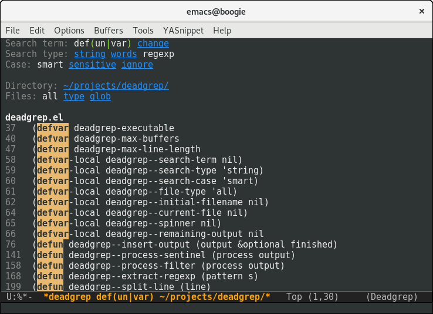

# deadgrep: use ripgrep from Emacs [](https://travis-ci.org/Wilfred/deadgrep) [](https://coveralls.io/github/Wilfred/deadgrep?branch=master)

deadgrep.el is the fast, beautiful text search that your Emacs
deserves.



## Installation

1. Install [ripgrep](https://github.com/BurntSushi/ripgrep).

2. Install deadgrep from MELPA (coming soon) or copy it into your
   ~/.emacs.d.

3. (Optional) add deadgrep to a convenient shortcut. I like F5.

``` emacs-lisp
(global-set-key (kbd "<f5>") #'deadgrep)
```

## Super Fast

deadgrep.el uses ripgrep for extremely fast text searches. It then
minimises keystrokes to get you results as soon as possible.

If you change your search settings, deadgrep.el immediately re-runs
the search.

If you're searching a large project, then deadgrep.el shows a spinner
to give you feedback.

## Easy Filtering

Didn't get the results you wanted? It's easy to change the search
term, search type, or search directory, directly from the results
buffer. Just push the relevant button.

## Alternative Projects

I believe that deadgrep.el is the best tool for doing Emacs text
searches, but there are some other great tools out there. See
[ALTERNATIVES](ALTERNATIVES.md) for a discussion.
